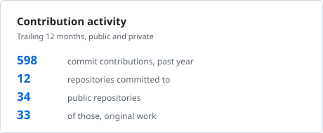
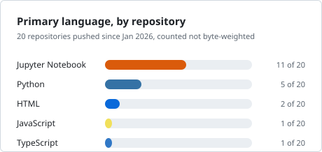

# Vishal Khan

**AI and machine learning engineer, London.**

I ship LLM systems to production, and I check whether their numbers mean
anything. Those are the same job. My current MSc dissertation at Northeastern
University London is on agent reliability and evaluation tooling, which is the
formal version of what the repositories below already do.

[](https://vishalkhan.me)
[](https://ai-professional-twin.vercel.app)
[](https://www.linkedin.com/in/vishalkhandatascience/)
[](resume.pdf)

---

## Ask my AI twin instead of reading this

[**ai-professional-twin.vercel.app**](https://ai-professional-twin.vercel.app)
is a live RAG assistant that answers questions about my work from a cited
knowledge base. No signup. It streams the answer and then shows you which
source chunk each claim came from, so you can check it.

It will tell you when it does not know. That was the harder half to build.

Three modes, three citation policies. Things worth asking it:

| General | Recruiter | Interview |
| --- | --- | --- |
| What projects has he built? | Summarise him as a candidate in 60 seconds | Explain the RAG architecture in this project |
| What is his MSc thesis about? | Will he require visa sponsorship? | What chunking strategy did you use, and why? |
| What databases has he worked with? | When is he available to start? | How do you handle prompt injection? |

## Selected work

### [trail-scorer-audit](https://github.com/DataScienceVishal/trail-scorer-audit) · a program that cannot read outscores every published model

TRAIL is a benchmark of annotated agent traces from Patronus AI. Its paper
reports the best model at 11 percent. I audited the scoring code behind that
number.

| GAIA, 116 gold files | joint accuracy | location accuracy |
| --- | --- | --- |
| `all-spans-all-categories`, which never opens a span | **0.973** | **0.974** |
| best published, their Table 1 | 0.183 | 0.546 |

Both headline metrics divide by the number of errors in the answer key and
never by the number the judge reported, so emitting everything wins.

<details>
<summary>Nine properties, pre-registered before the code existed</summary>

Each property is one a competent scorer should have, written down and frozen
before I had measured anything. Pre-registration is what stops an audit from
becoming a search for whichever number looks worst.

Seven were violated, two came back latent. Highlights:

| property | verdict | magnitude |
| --- | --- | --- |
| P1 gold-blind predictor scores no better than a published judge | VIOLATED | 0.973 against 0.183 on GAIA; 0.958 against 0.050 on SWE-Bench |
| P3 every gold annotation file parses as JSON | VIOLATED | 147 of 148 parse, so every published average divides by 147 |
| P6 no string shorter than the shortest label normalises to a label | VIOLATED | shortest label is 12 characters, all 21 are reachable in 2 or fewer |
| P7 per-category F1 separates right-span from anywhere | VIOLATED | identical 21 columns at 0.974 and at 0.000 location accuracy |
| P9 repository split sizes match the paper's Table 5 | VIOLATED | 8 of 10 comparable cells disagree |

Every figure was measured with the corpus on disk and committed as an
artifact. CI covers the code, not the numbers, and the README says so.

The audit was only possible because the TRAIL authors published their scorer,
their gold labels and their traces. A benchmark that publishes a leaderboard
and keeps its scoring code private cannot be checked from outside.

</details>

### [twicerun](https://github.com/DataScienceVishal/twicerun) · run a pipeline five times, find out which steps lie

```
1 daily_revenue          4 of 4  DIVERGENT  VALUE_DRIFT  cause PARALLEL_ORDER
4 append_audit_log       4 of 4  DIVERGENT  MULTIPLICITY cause PERSISTS_SINGLE_THREADED
6 sparse_customer_keys   0 of 4  STABLE_ON_THIS_INPUT

5 of 8 steps diverged in 13.4s.
```

Running a pipeline five times is the easy half. Deciding whether two of its
outputs are the same answer is the project: DuckDB sums a parallel aggregate in
whatever order the threads finish, float addition is not associative, and a
naive two-run diff therefore reports hundreds of findings on correct code.

<details>
<summary>Why the honest verdict has more than two values</summary>

`STABLE_ON_THIS_INPUT` is the reason this exists. Step 6 above is a real bug
that agreed with itself on all four comparisons, which a plain five-run loop
reports as a clean pass. Distinguishing "observed no divergence" from "is
deterministic" is the difference between a useful tool and a false negative
generator.

`mean_basket` is the opposite case: correct code whose float average moves in
the last few bits, reported as `VALUE_DRIFT` with the ulp distance attached so
a reader can dismiss it in one look.

Findings carry a cause, not just a diff. `PARALLEL_ORDER` and
`PERSISTS_SINGLE_THREADED` are different bugs with different fixes, and a
report that cannot tell them apart hands the triage work back to you.

</details>

### [lesion-split](https://github.com/DataScienceVishal/lesion-split) · a result I did not want

HAM10000 photographs some skin lesions more than once. Split it by image and
38.3 percent of your test set is repeat photographs of lesions the model
trained on.

| split | test images leaked |
| --- | --- |
| `by_image` | **38.3%** (36.5 to 40.0) |
| `by_lesion` | 0.0% |

Published audits report the correction costing several points. On this model it
costs about one and a half, and on both class-balanced metrics the interval
crosses zero.

<details>
<summary>The gap, over 8 paired seeds</summary>

| metric | image split minus lesion split | 95% interval | seeds above zero |
| --- | --- | --- | --- |
| accuracy | +1.54 points | +0.44 to +2.64 | 7 of 8 |
| balanced accuracy | +1.94 points | -0.84 to +4.73, crosses zero | 5 of 8 |
| macro F1 | +1.31 points | -0.97 to +3.59, crosses zero | 5 of 8 |

The leakage is real and easy to demonstrate. What it is worth to a model is a
separate question, and the answer here is "less than you would think, for this
model". Reporting that, rather than the headline the leakage number invites,
is the whole point of running the experiment.

</details>

### [ai-professional-twin](https://github.com/DataScienceVishal/ai-professional-twin) · production RAG, 390 tests in CI

FastAPI, ChromaDB and Azure OpenAI behind a React 19 front end streaming over
SSE. Eight LLM-callable tools, three answer modes with separate citation
policies, and 87 documents indexed in the running deployment.

Live on Azure Container Apps at about **$4.70/month**, with a GitHub Actions to
GHCR image pipeline. **390 tests** (276 backend, 114 frontend) under mypy
strict, ruff and oxlint.

<details>
<summary>The retrieval and injection details that took the time</summary>

Source-aware retrieval applies per-source distance thresholds *before*
preference boosting, so a preferred source wins a near-tie but cannot drag an
irrelevant chunk into the prompt. Getting that order wrong is how a boosted
retriever quietly becomes a worse retriever.

Follow-up questions fold the previous two turns into the embedding query, which
holds the subject across "and what about that one?" without a second LLM call.

Auto-ingested GitHub READMEs are delimited as untrusted data, because a
knowledge base that pulls from public repositories is a knowledge base a
stranger can write to. Injection defences are regression-tested across all
three modes rather than checked once by hand.

</details>

## Recent activity

<!-- profile:activity -->
| repository | what it is | last push |
| --- | --- | --- |
| [twicerun](https://github.com/DataScienceVishal/twicerun) | An audit of the TRAIL benchmark's scorer. Both headline metrics divide by the gold count, so a… | 8 Sep 2026 |
| [trail-scorer-audit](https://github.com/DataScienceVishal/trail-scorer-audit) | Runs a batch pipeline several times and reports, per step, how often it failed to give the… | 7 Sep 2026 |
| [lesion-split](https://github.com/DataScienceVishal/lesion-split) | A skin lesion classifier scored two ways. Splitting HAM10000 by image leaks 38% of the test… | 3 Sep 2026 |
| [DataScienceVishal.github.io](https://github.com/DataScienceVishal/DataScienceVishal.github.io) | Personal portfolio. React 19, Vite, Tailwind v4, Motion. Every claim on the page carries a… | 2 Sep 2026 |
| [ai-professional-twin](https://github.com/DataScienceVishal/ai-professional-twin) | _no description_ | 29 Aug 2026 |
<!-- /profile:activity -->

<!-- profile:stamp -->
<sub>Generated from the GitHub API on 8 Sep 2026. See <a href="scripts/">scripts/</a>.</sub>
<!-- /profile:stamp -->

## Cards

<picture>
  <source media="(prefers-color-scheme: dark)" srcset="assets/stats-dark.svg">
  
</picture>

<picture>
  <source media="(prefers-color-scheme: dark)" srcset="assets/languages-dark.svg">
  
</picture>

Generated by [`scripts/`](scripts/) in this repository and committed as SVG
rather than fetched from a shared third-party renderer. The previous version of
this profile used one of those, and it spent a long stretch returning HTTP 503.

Two notes on the second card, since a chart without its method is decoration.
It counts repositories by primary language instead of weighting by bytes,
because a `.ipynb` stores its output images as base64 inside the document: byte
weighted, these repositories read as 92 percent Jupyter Notebook, which
measures matplotlib rather than anything about me. And it states its window on
its face, because the all-time figure is different and a reader is entitled to
know which one they are looking at.

The first card reports commit contributions rather than stars and followers.
I have almost none of either, but that is not why. Neither one measures work.

## Toolchain

| | |
| --- | --- |
| **Languages** | Python, SQL, TypeScript, JavaScript, R |
| **LLM and agents** | RAG, agentic systems, tool calling, MCP, LangChain, Azure OpenAI, prompt-injection defence, evaluation harnesses |
| **ML** | PyTorch, TensorFlow, scikit-learn, SentenceTransformers, reinforcement learning, time-series forecasting |
| **Engineering** | FastAPI, Pydantic, ChromaDB, SSE streaming, React 19, Vite, Tailwind, Docker, uv, DuckDB |
| **Platform** | Azure Container Apps, Databricks, AWS, GitHub Actions, GHCR, Vercel |
| **Testing** | pytest, vitest, mypy (strict), ruff, oxlint |
| **Data and BI** | SQL Server, MySQL, MongoDB, Neo4j, Power BI, Tableau |

<details>
<summary><b>Background, education and availability</b></summary>

### Now

MSc Artificial Intelligence and Computer Science, **Northeastern University
London**, Jan 2026 to Jan 2027. 95/100 in Programming for Data Applications.
Dissertation on agentic AI, focused on agent reliability and evaluation
tooling.

### Before

**Data Engineer, Teleperformance Global Business** (June 2024 to Jan 2026).
Built and maintained Databricks pipelines over millions of telecom records
(CDRs, billing, agent performance), serving a data engineering team of 50+
across multiple regions. Migrated on-prem SQL Server schemas to Databricks,
improving query performance and cutting infrastructure cost by roughly 20
percent each. Owned 9 pipelines end to end on Databricks Workflows, retiring
30+ recurring manual reports.

**Commercial and Sales Analytics, Avant Garde** (Aug 2021 to Dec 2023). ML
sales forecasting at 10 to 20 percent MAPE, used daily for commercial
planning. Rebuilt revenue and collections reporting, cutting the monthly cycle
from about 2 hours to about 30 minutes.

Four years in finance, accounts and taxation before any of this.

### Education

| | |
| --- | --- |
| MSc Artificial Intelligence and Computer Science | Northeastern University London, 2026 to 2027 |
| MSc Data Science | Liverpool John Moores University, 2023 to 2024 |
| Executive PG Programme in Data Science | IIIT Bangalore, 2022 to 2023 |
| BCom | University of Delhi, 2018 to 2021 |

### Earlier research

**MSc thesis, LJMU 2024.** Reinforcement learning for dynamic pricing in
e-commerce. Built a Gym-style environment on real e-commerce data, then trained
and compared DQN, A2C and PPO across multi-episode simulations. DQN produced
the most stable profit curve.

**Multi-agent pricing system.** An ensemble of specialist agents with a
coordinator reconciling their outputs, over SentenceTransformer embeddings in
Chroma. Benchmarked 16 models on one harness, from XGBoost through five
frontier LLMs to fine-tuned open models. A fine-tuned 4-bit Llama 3.2 cut error
62 percent below the constant baseline and beat every frontier model tested,
including GPT-5.1 by 11 percent, moving the same base model from
worse-than-baseline to best-in-class through fine-tuning alone.

### Availability

Right to work in the UK. Part-time now, full-time from February 2027, then 18
months unsponsored. Eligible to switch to Skilled Worker as a new entrant
thereafter, so **no sponsor licence is required to hire me**.

</details>

## Contact

[vishalkhan251@gmail.com](mailto:vishalkhan251@gmail.com) ·
[LinkedIn](https://www.linkedin.com/in/vishalkhandatascience/) ·
[vishalkhan.me](https://vishalkhan.me) ·
[resume](resume.pdf)
